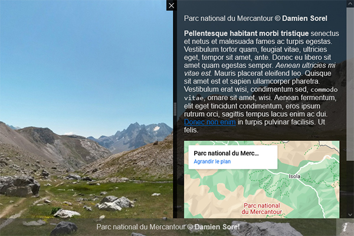
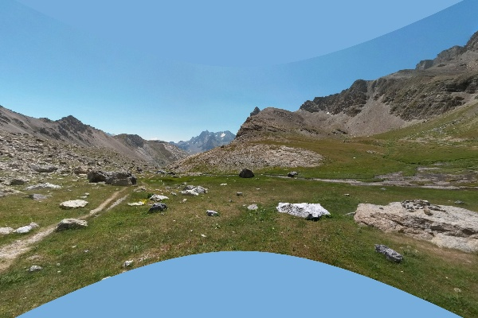
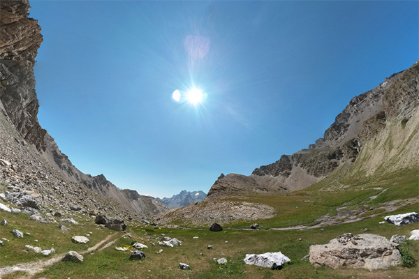
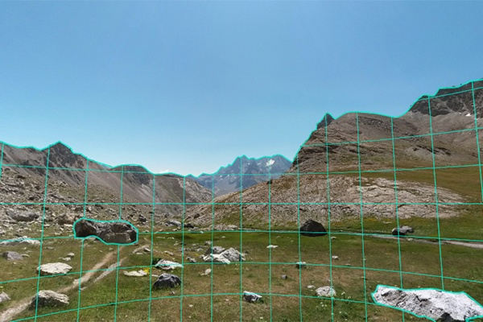
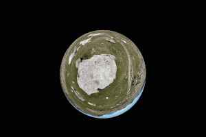
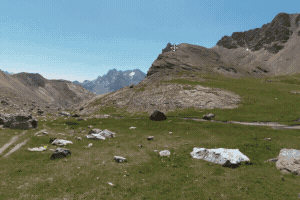
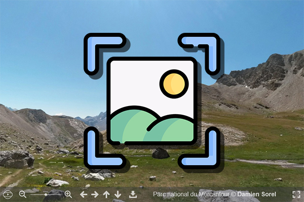
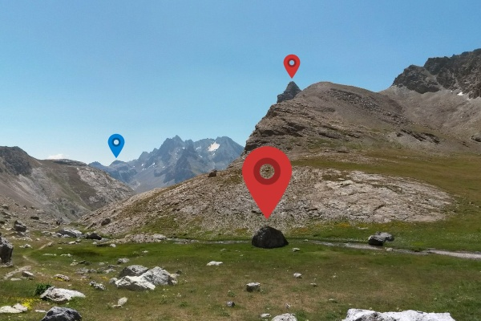
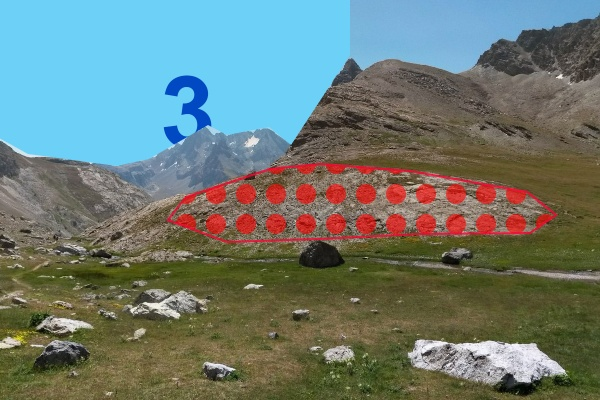

# Demos

::: tip Plugins
Visit each [plugin page](../plugins/) to see a dedicated example.
:::

## Basic

:::: gallery

::: item

### Zero config

Simple panorama with default options.
:::

::: item

### Custom navbar

Customize the navbar with default and custom buttons.
:::

::: item

### Description

&laquo; i &raquo; button will display the `description` in the side panel.
:::

::: item

### Cropped panorama

Display cropped panorama.
:::

::: item

### Fisheye

Display the panorama with a fisheye effect.
:::

::: item

### Overlay

Display a secondary image above the panorama.
:::

::::

## Advanced

:::: gallery

::: item

### Intro animation

Use the `Animation` helper to create a cool intro.
:::

::: item

### Double click zoom

Zoom to the cursor position on double-click.
:::

::: item

### Make a screenshot

Download a screenshot of the visible panorama.
:::

::::

## Markers

:::: gallery

::: item

### Custom tooltip

Advanced styling of a marker's tooltip.
:::

::: item

### Mouse hover scaling

Enable global scaling and customize for each marker.
:::

::: item

### Polygon pattern

Use custom SVG patterns as polygon `fill`.
:::

::::
