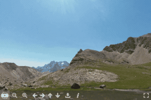

# Demos

::: tip Want your demo here ?
Create a JSFiddle by forking [PSV Home Demo](https://jsfiddle.net/mistic100/5r684etx/) and submit a pull request to add it to the documentation.
:::

::: tip Plugins
Visit each [plugin page](../plugins/) to see an example.
:::

## Basic

:::: gallery

::: item link="https://jsfiddle.net/mistic100/5r684etx/show"

### Zero config
Simple panorama with default options.
:::

::: item link="https://jsfiddle.net/mistic100/cLp08us4/show"

### Description
&laquo; i &raquo; button will display the `description` in the side panel.
:::

::: item link="https://jsfiddle.net/mistic100/j63dqub9/show"

### Custom navbar
Customize the navbar with default and custom buttons.
:::

::: item link="https://jsfiddle.net/mistic100/95asmzve/show"

### Fisheye
Display the panorama with a fisheye effect.
:::

::: item link="https://jsfiddle.net/mistic100/wpvtyz1j/show"

### Autorotate
Automatically performs a rotation if the user is innactive.
:::

::: item link="https://jsfiddle.net/mistic100/wsL1x5k0/show"

### Intro animation
Use the `Animation` helper to create a cool intro.
:::

::::

## Markers

:::: gallery

::: item link="https://jsfiddle.net/mistic100/Lm3wzesb/show"

### Custom tooltip
Advanced styling of a marker's tooltip.
:::

::::
