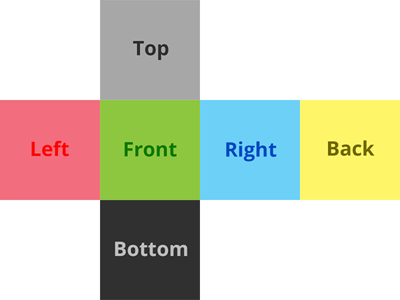

# Cubemap

<Badges module="cubemap-adapter"/>

::: module
[Cube mapping](https://en.wikipedia.org/wiki/Cube_mapping) is a kind of projection where the environment is mapped to the six faces of a cube around the viewer.

This adapter is available in the [@photo-sphere-viewer/cubemap-adapter](https://www.npmjs.com/package/@photo-sphere-viewer/cubemap-adapter) package.
:::

```js
const viewer = new PhotoSphereViewer.Viewer({
    adapter: PhotoSphereViewer.CubemapAdapter,
    panorama: {
        left: 'path/to/left.jpg',
        front: 'path/to/front.jpg',
        right: 'path/to/right.jpg',
        back: 'path/to/back.jpg',
        top: 'path/to/top.jpg',
        bottom: 'path/to/bottom.jpg',
    },
});
```

## Example

::: code-demo

```yaml
title: PSV Cubemap Demo
packages:
    - name: cubemap-adapter
      imports: CubemapAdapter
```

```js
const baseUrl = 'https://photo-sphere-viewer-data.netlify.app/assets/';

const viewer = new PhotoSphereViewer.Viewer({
    container: 'viewer',
    adapter: PhotoSphereViewer.CubemapAdapter,
    panorama: {
        left: baseUrl + 'cubemap/px.jpg',
        front: baseUrl + 'cubemap/nz.jpg',
        right: baseUrl + 'cubemap/nx.jpg',
        back: baseUrl + 'cubemap/pz.jpg',
        top: baseUrl + 'cubemap/py.jpg',
        bottom: baseUrl + 'cubemap/ny.jpg',
    },
    caption: 'Parc national du Mercantour <b>&copy; Damien Sorel</b>',
    loadingImg: baseUrl + 'loader.gif',
    touchmoveTwoFingers: true,
    mousewheelCtrlKey: true,
});
```

:::

## Configuration

#### `flipTopBottom`

-   type: `boolean`
-   default: `false`

Set to `true` if the top and bottom faces are not correctly oriented.

## Panorama options

When using this adapter, the `panorama` option and the `setPanorama()` method accept three types of cubemaps.

### Separate files

Each face is in a separate file, all files will be loaded before showing the panorama.

```js
// With an array (order is important)
panorama: [
  'path/to/left.jpg',
  'path/to/front.jpg',
  'path/to/right.jpg',
  'path/to/back.jpg',
  'path/to/top.jpg',
  'path/to/bottom.jpg',
]

// With an object
panorama: {
  left:   'path/to/left.jpg',
  front:  'path/to/front.jpg',
  right:  'path/to/right.jpg',
  back:   'path/to/back.jpg',
  top:    'path/to/top.jpg',
  bottom: 'path/to/bottom.jpg',
}

// Alternatively
panorama: {
  type: 'separate',
  paths: /* array or object */
}
```

### Stripe

All faces are in a single file arranged in an horizontal stripe. The default stripe order is `left, front, right, back, top, bottom` but it can be changed with the `order` field.


```js
panorama: {
  type: 'stripe',
  path: 'path/to/panorama.jpg',
  order: ['left', 'right', 'top', 'bottom', 'back', 'front'] // optional
}
```

### Polyhedron net

All faces are in a single file arranged in an horizontal "T" unfolded cube.



```js
panorama: {
  type: 'net',
  path: 'path/to/panorama.jpg',
}
```
