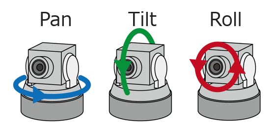

# Configuration

[[toc]]

::: tip Angles definitions
Photo Sphere Viewer uses a lot of angles for its configuration, most of them can be defined in radians by using a simple number (`3.5`) or in degrees using the "deg" suffix (`'55deg'`).
:::

::: tip Positions definitions
Some methods takes positionnal arguments, this is either on combination `longitude` and `latitude` (radians or degrees, **note:** those are local coordinates and not related to GPS) or `x` and `y` properties (corresponding to the pixel position on the source panorama file).
:::

## Standard options

#### `container` (required)
- type: `HTMLElement | string`

HTML element which will contain the panorama, or identifier of the element.

```js
container: document.querySelector('.viewer')

container: 'viewer' // will target [id="viewer"]
```

#### `panorama` (required)
- type: `*`

Path to the panorama. Must be a single URL for the default equirectangular adapter. Other adapters support other values.

#### `adapter`
- default: `equirectangular`

Which [adapter](./adapters) used to load the panorama.

#### `plugins`
- type: `array`

List of enabled [plugins](../plugins/README.md).

#### `caption`
- type: `string`

A text displayed in the navbar. If the navbar is disabled, the caption won't be visible. HTML is allowed.

#### `description`
- type: `string`

A text displayed in the side panel when the user clicks the "i" button. HTML is allowed.

#### `downloadUrl`
- type: `string`
- default: `=panorama` for equirectangular panoramas

Define the file which will be downloaded with the `download` button. This is particularly useful for adapters that use multiple files, like the CubemapAdapter or the EquirectangularTilesAdapter.

#### `size`
- type: `{ width: integer, height: integer }`

The final size of the panorama container. By default the size of `container` is used and is followed during window resizes.

#### `navbar`

Configuration of the [navbar](./navbar.md).

#### `minFov`
- type: `integer`
- default: `30`

Minimal field of view (corresponds to max zoom), between 1 and 179.

#### `maxFov`
- type: `integer`
- default: `90`

Maximal field of view (corresponds to min zoom), between 1 and 179.

#### `defaultZoomLvl`
- type: `integer`
- default: `50`

Initial zoom level, between 0 (for `maxFov`) and 100 (for `minfov`).

#### `fisheye`
- type: `boolean | double`
- default: `false`

Enable fisheye effect with `true` or specify the effect strength (`true` = `1.0`).

::: warning
This mode can have side-effects on markers rendering and some adapters.
:::

#### `defaultLong`
- type: `double | string`
- default: `0`

Initial longitude, between 0 and 2π.

#### `defaultLat`
- type: `double | string`
- default: `0`

Initial latitude, between -π/2 and π/2.

#### `autorotateDelay`
- type: `integer`
- default: `null`

Delay after which the automatic rotation will begin, in milliseconds.

#### `autorotateIdle`
- type: `boolean`
- default: `false`

Restarts the automatic rotation if the user is idle for `autorotateDelay`.

**Note:** the rotation won't restart of the user explicitly clicks on the navbar button.

#### `autorotateSpeed`
- type: `string`
- default: `2rpm`

Speed of the automatic rotation. Can be a negative value to reverse the rotation.

#### `autorotateLat`
- type: `double | string`
- default: `defaultLat`

Latitude at which the automatic rotation is performed.

#### `autorotateZoomLvl` <Badge text="4.7.3"/>
- type: `number`
- default: `null`

Zoom level at which the automatic rotation is performed. If `null` the current zoom is kept.

#### `lang`
- type: `object`
- default:
```js
lang: {
  autorotate: 'Automatic rotation',
  zoom      : 'Zoom',
  zoomOut   : 'Zoom out',
  zoomIn    : 'Zoom in',
  move      : 'Move',
  download  : 'Download',
  fullscreen: 'Fullscreen',
  menu      : 'Menu',
  twoFingers: 'Use two fingers to navigate',
  ctrlZoom  : 'Use ctrl + scroll to zoom the image',
  loadError : 'The panorama can\'t be loaded',
}
```

Various texts used in the viewer.

#### `loadingImg`
- type: `string`

Path to an image displayed in the center of the loading circle.

#### `loadingTxt`
- type: `string`
- default: `'Loading...'`

Text displayed in the center of the loading circle, only used if `loadingImg` is not provided.

#### `mousewheel`
- type: `boolean`
- default: `true`

Enables zoom with the mouse wheel.

#### `mousemove`
- type: `boolean`
- default: `true`

Enables panorama rotation with mouse click+move or with a finger swipe on touch screens.

#### `mousewheelCtrlKey`
- type: `boolean`
- default: `false`

Requires to use the ctrl key to zoom the panorama. This allows to scroll on the page without interfering with the viewer. If enabled, an overlay asking the user to use ctrl + scroll is displayed when ctrl key is not pressed.

#### `touchmoveTwoFingers`
- type: `boolean`
- default: `false`

Requires two fingers to rotate the panorama. This allows standard touch-scroll navigation in the page containing the viewer. If enabled, an overlay asking the user to use two fingers is displayed when only one touch is detected.


## Advanced options

#### `overlay` <Badge text="4.7.1"/>
- type: `*`

Path to an additional transparent panorama which will be displayed on top of the main one. The overlay can also be changed with the `setOverlay()` method or within the options of the `setPanorama()` method.

::: warning Adapters
Only the default [equirectangular](./adapters/equirectangular.md) and the [cubemap](./adapters/cubemap.md) adapters support this feature.
:::

#### `overlayOpacity` <Badge text="4.7.1"/>
- type: `number`
- default: `1`

Opacity of the `overlay`.

#### `sphereCorrection`
- type: `{ pan: double, tilt: double, roll: double }`
- default: `{ pan:0, tilt:0, roll: 0 }`

Allows to rotate the panorama sphere. Angles are in radians.

**Note:** if the XMP data and/or `panoData` contains heading/pitch/roll data, they will be applied before `sphereCorrection`.



#### `moveSpeed`
- type: `double`
- default `1`

Speed multiplicator for panorama moves. Used for click move, touch move and navbar buttons.

#### `zoomSpeed`
- type: `double`
- default `1`

Speed multiplicator for panorama zooms. Used for mouse wheel, touch pinch and navbar buttons.

#### `useXmpData`
- type: `boolean`
- default `true`

Read real image size from XMP data, must be kept `true` if the panorama has been cropped after shot. This is used for [cropped panorama](./adapters/equirectangular.md#cropped-panorama).

#### `panoData`
- type: `object | function<Image, object>`

Overrides XMP data found in the panorama file (or simply defines it if `useXmpData=false`).
All parameters are optional.

```js
panoData: {
  fullWidth: 6000,
  fullHeight: 3000,
  croppedWidth: 4000,
  croppedHeight: 2000,
  croppedX: 1000,
  croppedY: 500,
  poseHeading: 270, // 0 to 360
  posePitch: 0, // -90 to 90
  poseRoll: 0, // -180 to 180
}
```

It can also be a function to dynamically compute the cropping config depending on the loaded image.

```js
panoData: (image) => ({
  fullWidth    : image.width,
  fullHeight   : Math.round(image.width / 2),
  croppedWidth : image.width,
  croppedHeight: image.height,
  croppedX     : 0,
  croppedY     : Math.round((image.width / 2 - image.height) / 2),
})
```

**Note:** if the XMP data and/or `panoData` contains heading/pitch/roll data, they will be applied before `sphereCorrection`.

::: warning
Only the default `equirectangular` adapter and low-resolution panorama of `equirectangular-tiles` supports `panoData`, for other adapters you can only use [`sphereCorrection`](#spherecorrection) if the tilt/roll/pan needs to be corrected.
:::

#### `requestHeaders`
- type: `object | function<string, object>`

Sets the HTTP headers when loading the images files.

```js
requestHeaders: {
  header: value,
}
```

It can also be a function to dynamically set the request headers before every call. This can be useful when adding a Bearer, which is temporarily valid, to the Authorization header.

```js
requestHeaders: (url) => ({
   header: value,
})
```

#### `canvasBackground`
- type: `string`
- default: `#000`

Background of the canvas, which will be visible when using cropped panoramas.

#### `moveInertia`
- type: `boolean`
- default: `true`

Enabled smooth animation after a manual move.

#### `withCredentials`
- type: `boolean`
- default: `false`

Use credentials for HTTP requests.

#### `keyboard`
- type: `boolean | object`
- default:
```js
keyboard: {
  'ArrowUp': 'rotateLatitudeUp',
  'ArrowDown': 'rotateLatitudeDown',
  'ArrowRight': 'rotateLongitudeRight',
  'ArrowLeft': 'rotateLongitudeLeft',
  'PageUp': 'zoomIn',
  'PageDown': 'zoomOut',
  '+': 'zoomIn',
  '-': 'zoomOut',
  ' ': 'toggleAutorotate',
}
```

Enable and configure keyboard navigation in fullscreen. It is a map defining key code->action. Set to `false` to disable.

(all the available actions are listed above)
